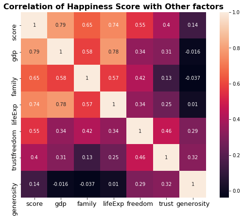
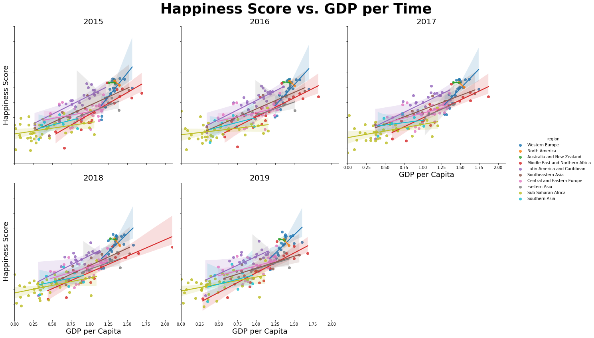
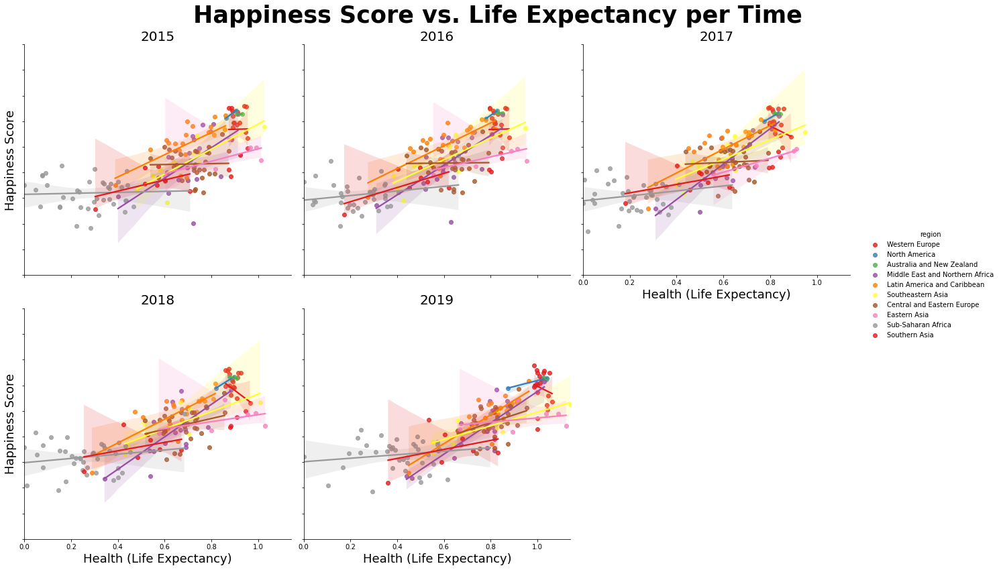
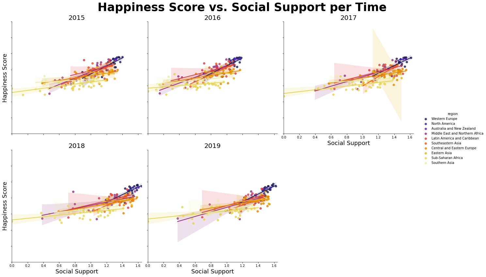
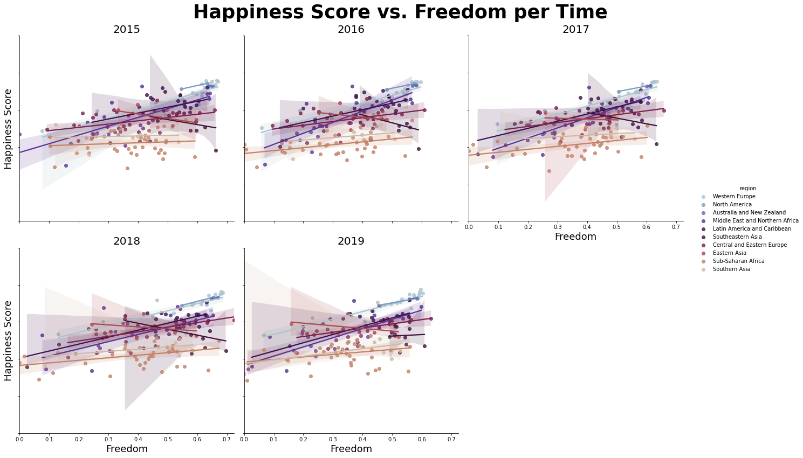
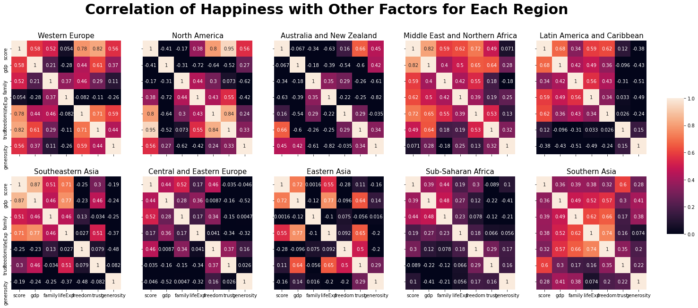
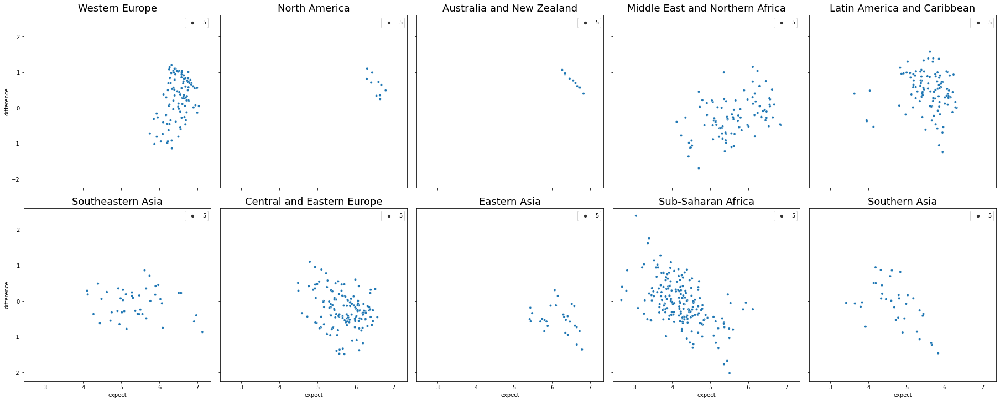
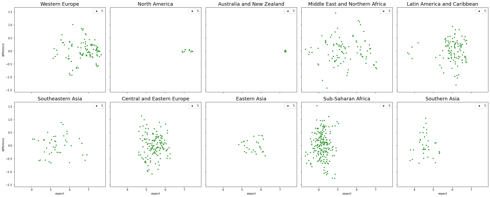

---
jupyter:
  kernelspec:
    display_name: Python 3
    language: python
    name: python3
  language_info:
    codemirror_mode:
      name: ipython
      version: 3
    file_extension: .py
    mimetype: text/x-python
    name: python
    nbconvert_exporter: python
    pygments_lexer: ipython3
    version: 3.9.0-final
  nbformat: 4
  nbformat_minor: 2
  orig_nbformat: 2
---

# What Makes You Happy?

**CMSC320: Intro to Data Science** 
Final Tutorial Project

> Fall 2020, Dahye Kang

------------------------------------------------------------------------

## Introduction

Happiness is one of the most important parts of human life. We feel
happiness from pleasure or joy instantaneously and feel happiness from
life satisfaction. Long-term life satisfaction is one of the most
important factors in human life and influence how society is satisfied,
not only the individual. Since 2012, based on the survey, people
digitize the answer to measure happiness from life satisfaction.

Every year, the World Happiness Report releases global happiness data
for each country. The reports review the state of happiness in the world
today and show how the digitized data of happiness explains personal and
national variations in happiness. Due to the efficiency and reliability
of happiness measurements, the report is used in organizations and civil
society to inform their policy-making decisions.

The scores are based on answers to the main life evaluation question
asked in the poll from Gallup World Poll. The questions ask for answers
in a range of 0 to 10 that zero is the worst possible life, and ten is
the best possible life. In the data, the columns following the happiness
score estimate the extent to which each of six factors -- economy (GDP
per Capita), social support (family), healthy life expectancy, freedom,
absence of corruption, and generosity; these explain why some countries
rank higher than others.

In this instruction, we will focus on how each factor influences a high
or low score, which leads to a high or low rank of happiness, and see
the priority factor of happiness; Money, healthy, or freedom?

------------------------------------------------------------------------

## 0. Getting Started {#0-getting-started}

All the work is based on Python 3 (Python 3.9.0) with the following
packages:

-   **pandas**:
    -   a module that use to make a date frame, organize, and do other
        various work for data table; necessary for data handling.
-   **numpy**:
    -   a module to use for multi-dimension array. Required when dealing
        with linear algebra calculation.
-   **matplotlib**:
    -   a module to visualize the data; can make various graphs. We only
        use the pyplot from matplotlib package.
-   **seaborn**:
    -   data visualization library based on matplotlib, but more various
        and high-level plot can use to visualize the data
-   **sklearn**:
    -   a module for machine learning to use to learn and predict the
        model in various way; linear regression, classfication, etc.

If you are new to this, install the modules using <code>pip
install \[module_name\]</code> (this is one way to install a
module; there is various way to install).

Import the modules like this in the code:

``` python
import pandas as pd
import numpy as np
from matplotlib import pyplot as plt
from sklearn import linear_model
from sklearn.model_selection import cross_validate
import seaborn as sns
```

After calling all the necessary modules, we need to download the
dataset. Each year, the World Happiness Report release the dataset, but
as we cannot download all the file individually, we use *kaggle.com* to
download already collected data for 2015 to 2019 by other users.

Download dataset in this link:
[World_Happiness](https://www.kaggle.com/unsdsn/world-happiness)

------------------------------------------------------------------------

## 1. Data Processing {#1-data-processing}

### 1.1 Reading Data from File {#11-reading-data-from-file}

In this section, the goal is reading data from CSV files, reorganizing
the data as we want. First, as each year data is in separate csv file,
we need to read each csv file. Read the CSV files for each year by
**pd.read_csv(filename)** method, and DO NOT add all data up yet; each
file has differet columns and columns\' name. Also, the original CSV
files do not have a column indicating year, I add the year column to the
DataFrame using **insert(location, column_name, column_value,
allow_duplicate = True)**.

``` python
years = [2015, 2016, 2017, 2018, 2019]
# read 2015.csv
data_2015 = pd.read_csv(f"WorldHappiness/2015.csv", sep=",")
data_2015.insert(0, "year", 2015, True)
# read 2016.csv
data_2016 = pd.read_csv(f"WorldHappiness/2016.csv", sep=",")
data_2016.insert(0, "year", 2016, True)
# read 2017.csv
data_2017 = pd.read_csv(f"WorldHappiness/2017.csv", sep=",")
data_2017.insert(0, "year", 2017, True)
# read 2018.csv
data_2018 = pd.read_csv(f"WorldHappiness/2018.csv", sep=",")
data_2018.insert(0, "year", 2018, True)
# read 2019.csv
data_2019 = pd.read_csv(f"WorldHappiness/2019.csv", sep=",")
data_2019.insert(0, "year", 2019, True)
```

Before making data efficient, we need to check that each dataset\'s
columns are different or equivalent. Here is the shape of each year
dataset:

-   2015 Data Shape: (158, 13)
-   2016 Data Shape: (157, 14)
-   2017 Data Shape: (155, 13)
-   2018 Data Shape: (156, 10)
-   2019 Data Shape: (156, 10)

Each year data has some different columns, so to make all year data to
one, we only use the columns that exist in all data set. Below is the
table showing which year\'s data is missing or named differently:


| 2015 | 2016 | 2017 | 2018 | 2019 |
| ---- | ---- | ---- | ---- | ---- | 
| Country | Country | Country | Country or region | Country or region |
| Region | Region | - | - | - |
  Happiness Rank | Happiness Rank | Happiness.Rank | Happiness Rank |Happiness Rank |
| Happiness Score | Happiness Score | Happiness Score | Happiness Score | Happiness Score |
| Standard Error | - | - | - | - |
| - | Lower Confidence Interval | Whisker.low | - | - |
| - | Upper Confidence Interval | Whisker.low | - | - |
| Economy (GDP per Capita) | Economy (GDP per Capita) | Economy..GDP.per.Capita. | GDP per capita | GDP per capita |
| Family | Family | Family | Social support | Social support |
| Health (Life Expectancy) | Health (Life Expectancy) | Health..life.Expectancy. | Healthy lift expenctancy | Healthy life expectancy |
| Freedom | Freedom | Freedom | Freedom to make life chices | Freedom to make life chices |
| Trust (Government Corruption) | Trust (Government Corruption) | Trust..Government.Corruption. | Perceptions of Corruption | Perceptions of Corruption |
| Generosity | Generosity | Generosity | Generosity | Generosity |                      
| Dystopia Residual | Dystopia Residual | Dystopia.Residual | - | - |


In summary, we will use the columns: country, region, rank, score, gdp,
family, lifeExp, freedom, trust, and generosity. There is no region data
in 2017, 2018, and 2019, but the region data is useful to analyze the
data by grouping it, we will merge the 2015 and 2016 region data to
2017, 2018, and 2019.

### 1.2 Fill the Empty Column {#12-fill-the-empty-column}

To get the region data from 2015 and 2016, sort the two datasets by
*Country* name, and extract only the *Country* and *Region* columns.
Then, the 2015 data and 2016 data have different length, so we need to
consider the case that the countries only exist in one of the dataset.
To prevent loss, we will merge the two region data as **outer** option
in **pd.merge** function.

``` python
#Sort data by Country
sort_2016 = data_2016.sort_values(by="Country")
sort_2015 = data_2015.sort_values(by="Country")

#Get the Country and Region columns only
region_2016 = sort_2016[["Country", "Region"]]
region_2015 = sort_2015[["Country", "Region"]]

#Merge two
region = pd.merge(region_2015,region_2016, how="outer")
```

-   region and country shape: (164, 2)

Now, the region has more region data than data from 2015 and 2016. After
making the region dataset, we will apply this region data to different
year datasets. The 2018 and 2019 dataset have different column name for
*Country* as *Country or region* (check the above column list table),
specifing the merge option that the column in left dataset to merge is
\"Country or region\" and the column in right dataset to merge is
\"Country\". The merge between the 2017, 2018, and 2019 data and region
data is inner merge (default); it will not include the row which cannot
find corresponding country and region in region data.

``` python
data_new_2017 = pd.merge(data_2017, region)
data_new_2018 = pd.merge(data_2018, region, left_on="Country or region", right_on="Country")
data_new_2019 = pd.merge(data_2019, region, left_on="Country or region", right_on="Country")
```

The outcome dataset shows the shape as:

-   2015 New Data Shape: (158, 13)
-   2016 New Data Shape: (157, 14)
-   2017 New Data Shape: (153, 14)
-   2018 New Data Shape: (154, 12)
-   2019 New Data Shape: (152, 12)

### 1.3 Extract and Rename {#13-extract-and-rename}

As above I said, we only need the data that are all common in every year
data.

``` python
#columns list to want to use
cols = ["year","country","region","rank","score","gdp","family","lifeExp","freedom","trust","generosity"]

#loop each year dataset and append the necessary data to list
data = []
for i, row in data_2015.iterrows():
    app = row[["year","Country","Region","Happiness Rank","Happiness Score","Economy (GDP per Capita)",
                "Family","Health (Life Expectancy)","Freedom","Trust (Government Corruption)","Generosity"]]
    data.append(app.array)

for i, row in data_2016.iterrows():
    data.append(row[["year","Country","Region","Happiness Rank","Happiness Score","Economy (GDP per Capita)",
                     "Family","Health (Life Expectancy)","Freedom","Trust (Government Corruption)",
                     "Generosity"]].array)

for i, row in data_new_2017.iterrows():
    data.append(row[["year","Country","Region","Happiness.Rank","Happiness.Score",
                    "Economy..GDP.per.Capita.","Family", "Health..Life.Expectancy.","Freedom",
                    "Trust..Government.Corruption.","Generosity"]].array)

for i, row in data_new_2018.iterrows():
    data.append(row[["year","Country or region","Region","Overall rank","Score",
                    "GDP per capita", "Social support", "Healthy life expectancy", 
                    "Freedom to make life choices", "Perceptions of corruption", "Generosity"]].array)

for i, row in data_new_2019.iterrows():
    data.append(row[["year","Country or region","Region","Overall rank","Score","GDP per capita", 
                    "Social support", "Healthy life expectancy", "Freedom to make life choices",
                    "Perceptions of corruption", "Generosity"]].array)

data= pd.DataFrame(data,columns=cols)
data.head()
```

| year | country | region      | rank           | score | gdp   | family  | lifeExp | freedom | trust   | generosity |
|------|---------|-------------|----------------|-------|-------|---------|---------|---------|---------|------------|
| 0    | 2015    | Switzerland | Western Europe | 1     | 7.587 | 1.39651 | 1.34951 | 0.94143 | 0.66557 | 0.41978    | 0.29678 |
| 1    | 2015    | Iceland     | Western Europe | 2     | 7.561 | 1.30232 | 1.40223 | 0.94784 | 0.62877 | 0.14145    | 0.43630 |
| 2    | 2015    | Denmark     | Western Europe | 3     | 7.527 | 1.32548 | 1.36058 | 0.87464 | 0.64938 | 0.48357    | 0.34139 |
| 3    | 2015    | Norway      | Western Europe | 4     | 7.522 | 1.45900 | 1.33095 | 0.88521 | 0.66973 | 0.36503    | 0.34699 |
| 4    | 2015    | Canada      | North America  | 5     | 7.427 | 1.32629 | 1.32261 | 0.90563 | 0.63297 | 0.32957    | 0.45811 |


Now, let's see how the data is related.

------------------------------------------------------------------------

## 2. Data Exploration and Analysis {#2-data-exploration-and-analysis}

The goal of this section is analyzing data as finding the relation of
six factors and happiness score. To see the global trend of relation
with factors and score, we plot the heatmap.

### 2.1 Global Trend {#21-global-trend}

To the dataset what we want to see the correlation, use the **corr()**
and return a correlation matrix. Using the seaborn, plot the heatmap
given the values as the correlation matrix.

``` python
#Corrleation Matrix
corrMatrix = data[["score","gdp","family","lifeExp","freedom","trust","generosity"]].corr()

#plot heatmap
plt.figure(figsize = (10, 7))
sns.heatmap(corrMatrix, annot=True, square=True)
plt.title("Correlation of Happiness Score with Other factors", fontweight = "bold", fontsize = 16)
plt.xticks(fontsize=13)
plt.yticks(fontsize=13)
plt.show()
```



The heatmap shows the correlations with the level of strongness through
the color difference. The color bar on right side indicate which color
is closed to 1 or 0. According to the heatmap, the score shows the
correlation coefficient as 0.79 for gdp, 0.65 for family, 0.74 for
lifeExp, 0.55 for freedom, 0.4 for trust, 0.14 for generoisty. The order
of strong coefficient is GDP \> Family \> Life Expectency \> Freedom \>
perceptions of corruption \> Generoisty.

In the Statistics, above 0.8 correlation coefficient is strong, above
0.5 and below 0.8 correlation coefficient is consider moderate, and
below 0.5 correlation coefficient is weak. Then, the gdp, family,
lifeExp, and freedom is considered moderate coefficient with no strong
coefficient. Leave the weak correlation coefficient, we will see that
how the four variable is related to score with region indication.

### 2.2 Happiness Score vs. GDP {#22-happiness-score-vs-gdp}

We will plot the multi linear regression line with scatter plot using
the **lmplot** in seaborn. The first plot we will look at is happiness
score vs. GDP. Set x value as *gdp* and y value is *score* with hue as
*region* (show regions in different colors). Set col is *year* and
col_wrap to 3 which are showing graph for each year data with three
columns. Then we can plot the 5 subplots of scatter plot with linear
regression line for each region.

``` python
plt.figure(figsize=(12, 10))
g = sns.lmplot(data = data, y = "score", x = "gdp", hue = "region", col = "year", col_wrap = 3, height = 6)
g.fig.suptitle("Happiness Score vs. GDP per Time", fontsize = 35, fontweight = "bold")
g.set_titles(col_template="{col_name}", size = 20)
g.set_yticklabels(fontsize = 10)
g.set_axis_labels("GDP per Capita", "Happiness Score", size = 18)
g.fig.subplots_adjust(wspace = 0.3, hspace = 0.4, top = 0.90, left = 0.1)
g.tight_layout()
plt.show()
```



The plot shows that the tendency of higher GDP with higher happiness
score in every year. If we see the each region\'s regression line, some
regions do not follow the global tendency. The North America and
Australia and New Zealand show that their score does not get high by
high GDP. The Western Europ shows the steep slope among other regions
which means high gdp countries have high score of happiness. Compared to
it, the Sub-Saharan Africa and Southern Asia show the GDP does not
influence much to the high score.

### 2.3 Happniess Score vs. Life Expectency {#23-happniess-score-vs-life-expectency}

Do the same way with the modification of x variable to *lifeExp*

``` python
plt.figure(figsize=(12,10))
g = sns.lmplot(data=data, y="score", x="lifeExp", hue="region", palette="Set1", col = "year", col_wrap = 3, height=6)
g.fig.suptitle("Happiness Score vs. Life Expectancy per Time", fontsize = 35, fontweight = "bold")
g.set_titles(col_template="{col_name}", size = 20)
g.set_yticklabels(fontsize = 10)
g.set_axis_labels("Health (Life Expectancy)", "Happiness Score", size = 18)
g.fig.subplots_adjust(wspace = 0.3, hspace = 0.4, top = 0.90, left = 0.1)
g.tight_layout()
plt.show()
```



The overall trend is that with higher lifeExp, the higher happiness
score is which is smaller than GDP slope. The Sub-Saharan Africa,
Central and Eastern Europe, and Western Europe show that same or similar
score with various lifeExp value meaning lifeExp does not influence much
on happiness. However, Middle East and Northern Africa and Latin America
and Caribbean show that high lifeExp reflect to score as high.

### 2.4 Happiness Score vs. Social Support {#24-happiness-score-vs-social-support}

Do same as above plots with the modification of x variable.

``` python
plt.figure(figsize=(12,10))
g = sns.lmplot(data = data, y ="score", x = "family", hue = "region", palette="CMRmap", col = "year", col_wrap = 3, height=6)
g.fig.suptitle("Happiness Score vs. Social Support per Time", fontsize = 35, fontweight = "bold")
g.set_titles(col_template="{col_name}", size = 20)
g.set_yticklabels(fontsize = 10)
g.set_axis_labels("Social Support", "Happiness Score", size = 18)
g.fig.subplots_adjust(wspace = 0.3, hspace = 0.4, top = 0.90, left = 0.1)
g.tight_layout()
plt.show()
```



This is also shows the high social support with high score but not much
as the lifeExp graph. Most of country does not reflect the high
happiness score with high social support, but the Western Europe reflect
it.

### 2.5 Happiness Score vs. Freedom {#25-happiness-score-vs-freedom}

Do same as above plots with modification of x variable

``` python
plt.figure(figsize=(12,10))
g = sns.lmplot(data=data, y="score", x="freedom", hue="region", palette="twilight", col = "year", col_wrap = 3, height=6)
g.fig.suptitle("Happiness Score vs. Freedom per Time", fontsize = 35, fontweight = "bold")
g.set_titles(col_template="{col_name}", size = 20)
g.set_yticklabels(fontsize = 10)
g.set_axis_labels("Freedom", "Happiness Score", size = 18)
g.fig.subplots_adjust(wspace = 0.3, hspace = 0.4, top = 0.90, left = 0.1)
g.tight_layout()
plt.show()
```



This shows the weak relations between happiness score and freedom that
most of country shows similar happiness score whatever the freedom gets.

### 2.6 Heatmap per Region {#26-heatmap-per-region}

The above plots show that the factors influenced to the happiness score
are different for each region. To see the correlation of factors and
score for each region, we will plot the 10 subplots of heatmaps.

``` python
#region list - 10 regions
region = data["region"].unique()
#subplots of 2x5 matrixs
fig, ax = plt.subplots(2, 5, figsize = (25, 10), constrained_layout = True, sharey = True, sharex = True)
j = 0
#show only one color bar in given location
cbar_ax = fig.add_axes([.9, .3, .02, .4])
#loop over the region list
for i, loc in enumerate(region):
    if i>0 and i%5 == 0:
        j+=1
    #correlation matrix for corresponding region
    corrMatrix = data[data["region"]==loc][["score","gdp","family","lifeExp","freedom","trust","generosity"]].corr()
    #heatmap for correlation matrix
    sns.heatmap(corrMatrix, cbar=i == 0, ax= ax[j][i%5],vmin=0,annot=True, cbar_ax=None if i else cbar_ax)
    ax[j][i%5].set_title(loc, loc = "center", fontsize = 15, fontweight = 10)
fig.tight_layout(rect=[0, 0, .98, 1])
fig.suptitle("Correlation of Happiness with Other Factors for Each Region", fontsize = 30, fontweight = "bold")
plt.show()
```



The chart listed the top three factors which is high correlation for
each region (indicate strong coefficient as
`<span style="color:#EF9342">`{=html}color`</span>`{=html}, moderate
coefficient as
`<span style="color:#C70039">`{=html}color`</span>`{=html}):


|  Region | First | Second | Third |
| ------- | ----- | ------ | ----- |
| ***Global*** | <span style="color:#C70039">GDP</span> | <span style="color:#C70039">lifeExp</span> | <span style="color:#C70039">Social Support</span> |
| ***Western Europe*** | <span style="color:#EF9342">trust</span> | <span style="color:#C70039">freedom</span> | <span style="color:#C70039">GDP</span>
| ***North America*** | <span style="color:#EF9342">trust</span>  |  <span style="color:#EF9342">freedom</span>  | <span style="color:#C70039">generosity</span> |
| ***Austraila and New Zealand*** | <span style="color:#C70039">trust</span> |  generosity | freedom |
| ***Middle East and Northern Africa*** | <span style="color:#EF9342">GDP</span>  | <span style="color:#C70039">freedom</span>  | <span style="color:#C70039">lifeExp</span>|
| ***Latin America and Caribbean*** | <span style="color:#C70039">GDP</span> |  <span style="color:#C70039">freedom</span> |  <span style="color:#C70039">lifeExp</span> |
| ***Southeastern Asia*** |  <span style="color:#EF9342">GDP</span>  |   <span style="color:#C70039">lifeExp</span>  | <span style="color:#C70039">social support</span> |
| ***Central and Eastern Europe*** | <span style="color:#C70039">family</span> freedom | GDP |
|  ***Eastern Asia*** | <span style="color:#C70039">GDP</span> | <span style="color:#C70039">lifeExp</span> |  trust |
| ***Sub-Saharan Africa*** | family | GDP | freedom |
| ***Southern Asia*** | <span style="color:#C70039">trust</span> | family | lifeExp |                                                         

Unlike the Global's strongest coefficient is GDP, the regions follow it
is only 4 out of 10. Assume that the country has enough economy growth
(high GDP), consider the perceptions of corruption and freedom to the
important factors for happiness; perceiving social values are important.
Also, for the country considered the GDP as first, they are also care
about the healthy life expectancy. So, I can assume that importance of
ecomonic growth comes with factor of healty life expectancy for the
happiness.

------------------------------------------------------------------------

## 3. Model Prediction {#3-model-prediction}

Based on above interpretation, We will find the model for global and
plot the residual scatter plot. Also, we will find the model per each
region, and see how well they predict compared to using global model.
All the finding is only based on top three facters for every model.

### 3.1 Global Model {#31-global-model}

We will use the *LinearRegression* method under *sklearn.linear_model*
for multi linear regression. For the global model, the x variable is
gdp, lifeExp, and family and y variable is score. Apply x and y to
**linEq.fit(x,y)** and get the slope and intercept.

``` python
linEq = linear_model.LinearRegression()
x = data[["gdp","lifeExp","family"]]
y = data["score"]
linEq.fit(x,y)
slope = linEq.coef_ #slope coefficient list
intercept = linEq.intercept_
print(f"Equation: score = {intercept:.4f} + {slope[0]:.4f}*(gdp) + {slope[1]:.4f}*(lifeExp) + {slope[2]:.4f}*(family)")
```

    Equation: score = 2.6423 + 1.2529*(gdp) + 1.1586*(lifeExp) + 0.8188*(family)


Now we get the expected y value based on original x using
**linEq.predict(x)**, and calculate residual by subracting original y to
expected y value. Then, add region column and original y column; it will
be used for plotting per each region.

``` python
predict_y = linEq.predict(x)
residual = np.subtract(y, predict_y)
residual = pd.DataFrame(np.array(residual), columns=["difference"])
residual["region"] = data["region"]
residual["original"] = y
residual["expect"] = predict_y
residual.head()
```

| difference | region   | original       | expect |
|------------|----------|----------------|--------|
| 0          | 0.999329 | Western Europe | 7.587  | 6.587671 |
| 1          | 1.040749 | Western Europe | 7.561  | 6.520251 |
| 2          | 1.096641 | Western Europe | 7.527  | 6.430359 |
| 3          | 0.936365 | Western Europe | 7.522  | 6.585635 |
| 4          | 0.990811 | North America  | 7.427  | 6.436189 |

Let's see how global model works in each region.

We will plot 10 subplots of residual plots using scatterplot.

``` python
#region list
region = data["region"].unique()
fig, ax = plt.subplots(2, 5, figsize = (25, 10), constrained_layout = True, sharey = True, sharex = True)
j = 0
for i, loc in enumerate(region):
    if i>0 and i%5 == 0: #update row
        j+=1
    #scatter plot
    sns.scatterplot(x="expect", y="difference", size=5, palette="ch:r=-.2,d=.3_r", ax= ax[j][i%5], data=residual[residual["region"]==loc])
    ax[j][i%5].set_title(loc, loc = "center", fontsize = 18, fontweight = 10)
plt.show()
```



Only the Southeastern Asia show acceptable residual plot, and rest of
plot show the pattern which mean the model is not working well.

To see the accurate score of model prediction, use the
**cross_validate(regression_method, x, y)**, and get the test score of
it with default 5-fold CV.

``` python
result = cross_validate(linEq, x, y)
global_square = np.array(result["test_score"])
print("R-Squared Score for global model in Avg: ",global_square.mean())
```
R-Squared Score for global model in Avg:  0.4221315680210174

### 3.2 Predict per Region {#32-predict-per-region}

Now we will find the model for each region based on top three factors
for each. Use a dict to save the top three factor for each region, and
find the model like above.

``` python
# make a table for top three factors each
top_three = {"region":region,
            "first":
            ["trust","trust","trust","gdp","gdp",
            "gdp","family","gdp","family","trust"],
            "second":
            ["freedom","freedom","generosity","freedom",
            "freedom","lifeExp","freedom","lifeExp","gdp",
            "family"],
            "third":
            ["gdp","generosity","freedom","lifeExp","lifeExp",
            "family","gdp","trust","freedom","lifeExp"]}
top_three = pd.DataFrame(top_three)
top_three.head()
```

| region | first                           | second | third      |
|--------|---------------------------------|--------|------------|
| 0      | Western Europe                  | trust  | freedom    | gdp        |
| 1      | North America                   | trust  | freedom    | generosity |
| 2      | Australia and New Zealand       | trust  | generosity | freedom    |
| 3      | Middle East and Northern Africa | gdp    | freedom    | lifeExp    |
| 4      | Latin America and Caribbean     | gdp    | freedom    | lifeExp    |

For each region, it get the top three factors list, do the multi linear
regression, predict y value based on original x, get the score of
prediction, and plot a scatter plot for residual vs. predicted value.

``` python
fig, ax = plt.subplots(2, 5, figsize = (25, 10), constrained_layout = True, sharey = True, sharex = True)
j = 0
score = []
for i, loc in enumerate(region):
    if i>0 and i%5 == 0: #update row
        j+=1
    #get three factors for certain region
    factors = top_three[top_three["region"]==loc][["first","second","third"]]
    #multi linear regression
    x = data[data["region"]==loc][factors.to_numpy().flatten()]
    y_loc = data[data["region"]==loc]["score"]
    linEq.fit(x, y_loc)
    #predict
    predict_y = linEq.predict(x)
    residual = np.subtract(y_loc, predict_y)
    residual = pd.DataFrame(np.array(residual), columns=["difference"])
    residual["original"] = y_loc.reset_index(drop=True)
    residual["expect"] = predict_y
    #get the score of prediction
    score.append(linEq.score(x,y_loc))
    #scatter plot for residual vs. predicted value
    sns.scatterplot(x="expect", y="difference", size=5, color="green", ax= ax[j][i%5], data=residual)
    ax[j][i%5].set_title(loc, loc = "center", fontsize = 18, fontweight = 10)
plt.show()
```



This graph shows much scattered points in each plot, which means the
model is working better than just using global model. Still, the Central
and Eastern Europe and Sub-Saharan Africa tend to clustered together
vertically, it is not the best fit model to them.

Unlike the global model, we do not use cross-validate due to small
number of data for each region. Below is the R-Square score for each
region:

``` python
for i, loc in enumerate(region):
    print(f"R-Squared Score for {loc:31} {score[i]:.4f}")
```

    R-Squared Score for Western Europe                  0.7637
    R-Squared Score for North America                   0.9650
    R-Squared Score for Australia and New Zealand       0.4905
    R-Squared Score for Middle East and Northern Africa 0.7752
    R-Squared Score for Latin America and Caribbean     0.6679
    R-Squared Score for Southeastern Asia               0.7681
    R-Squared Score for Central and Eastern Europe      0.4753
    R-Squared Score for Eastern Asia                    0.7523
    R-Squared Score for Sub-Saharan Africa              0.2967
    R-Squared Score for Southern Asia                   0.4608s

It shows that the model fit well for North America, and the Wstern
Europe, Middle East and Northern Africa, Southeastern Asia, and Eastern
Asia show the model is acceptable. It does not work well for Sub-saharan
Africa.

------------------------------------------------------------------------

## Conclusion

The main goal of instruction is finding out which factors is most
reflected in the happiness score. We used the top three factors to see
how the model fit, and get various score of prediction for each region.
Then, let\'s think about why some region get high score and others not.

In the data analysis step, through the heatmaps per region, we check
that which factors are strong correlation coefficient or not. The North
America shows first and second factors are strong coefficient, and thrid
factor is moderate. This means all three factors highly related to
happiness score. So, the prediction using these factors shows 0.965
R-Squared score. Contrast to it, the Sub-Saharan Africa\'s top three
factors are all weak correlation coefficient. Leading to it, the score
is also the lowest, meaning that the factors does not related to
happiness score much. These brings the idea that the higher correlation
coefficient is, the higher score get from the prediction based on the
variable.

If we consider this condition, the Western Europe get the highest
influence to the happiness score from perception of corruption, the
North America get the highest influence from perception of corruption
and freedom, the Middle East and Northern Africa get the highest
influence from economy (GDP per Capita), and also the Southeastern Asia
get the highest influence from economy (GDP per Capita). The rest of
region has the coefficient of moderate or weak, so it will not reflected
well in the happiness score.

Through the insctruction, we explore the data processing, data
analyzing, and model prediction based on data. Hope this is useful
information, and Thank you for sharing time to read.

Thank you.
